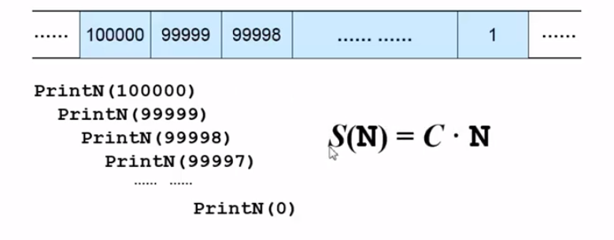

# 数据结构学习（一）
## 算法的定义
- 有限的指令集
- 产生输出
- 一定在有限的步骤之后终止
- 每一条指令必须
  - 充分明确的指标不可有歧义
  - 在计算机能处理的单位之内
  - 描述要抽象，不应依赖于任何一种计算机语言以及具体的实现手段
  - 如：选择排序的伪码描述

```
void selectionSort(int List[],int N)
{
  for(int i=0;i<N;i++)
  {
    MinPosition =ScanForMin(List,i,N-1);
  /* 从List[i]到List[N-1]中找到最小的元素，并将其位置赋给MinPostion：*/
    Swap(List[i],List[MinPosition]);
    /*将未排序部分的最小元素换到有序部分的最后位置；*/
  }
}
```

## 什么是好的算法
- 空间复杂度S(n)
>根据算法写成程序在执行时候占用的存储单元的长度。

备注：这个长度往往与输入数据的规模有关，而复杂度过高会造成内存使用超限进而程序中断

- 时间复杂度T(n)
>根据算法写成的程序在执行时耗费时间的长度。

这个长度往往也和输入数据的规模有关。时间复杂度过高会使得运行结果超时出现

#### Example关于递归调用的空间复杂度计算
```
void PrintN(int N)
{
  if(N)
  {
    PrintN(N-1);
    printf("%d\n",N);
  }
  return;
}

```

每调用一次PrintN就会在内存中占用一个用来记录程序段的内存单元线性增长故空间复杂度为S(N)=C*N，如下图：


#### Example关于多项式的运算的时间复杂度

```
//函数1
double f(int n,double a[],double x)
{
  int i;
  double p = a[0];
  for(i=1 ;i<=n;i++)
  {
    p+ =(a[i]*pow(x,i));
  }
  return p;
}

//函数2
double f (int n,double a[],double x)
{
  int i;
  double p=a[n];
  for(i=n;i>0;i--)
  {
    p=a[i-1]+x*p;
  }
  return p;
}
```

众所周知：执行加法的时间远远不及乘法
所以在此考虑时间复杂度的时候仅重视乘法；
函数1中使用了(1+2+3+...+n)=(n+1)n/2次乘法
而函数2中只用了n次乘法！！！

所以我们称函数1的时间复杂度为T(n)=C1n<sup>2</sup>+C2n
而函数2：T(n)=C1(n)
在分析一般算法的效率时，我们经常关注下面两种复杂度
- 最坏情况复杂度T<sub>worst</sub>(n)
- 平均复杂度T<sub>avg</sub>(n)
